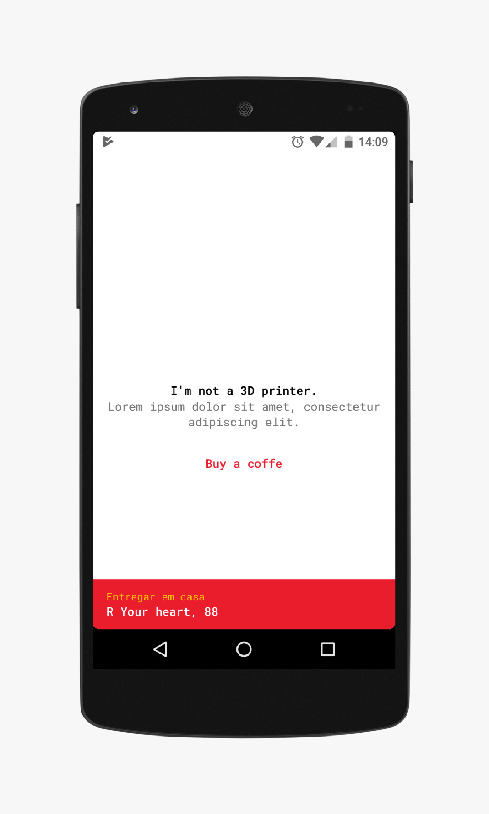

# CloneFood

This app show how you can achieve the same layout rounded effect as present in **iFood**.

The effect is a rounded border into our main container layout. This is really nice in devices that have rectangular screen.

## Warning 

You should take care of APIs below 23 because they do not support light status bar, it means that we should not use a white layout as our container like a did in the screenshot.
If we use a white background users will not be able to see theirs status bar.

I've managed to solve that adapting colours used for every API. This app have this 'fix' and you can see how to do that.
